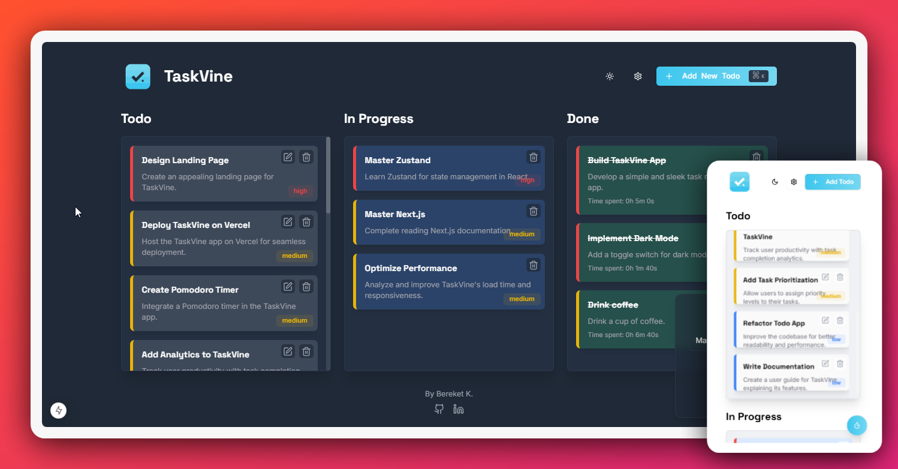

# TaskVine 🌿

A modern, feature-rich task management application built with Next.js and Zustand.



## ✨ Features

### Task Management
- **Kanban-style Board**: Organize tasks across Todo, In Progress, and Done columns
- **Drag & Drop Interface**: Seamlessly move tasks between different states
- **Priority Levels**: Set task priorities (High, Medium, Low)
- **Task Timer**: Track time spent on individual tasks
- **Rich Task Details**: Add descriptions and track creation dates

### Data Management
- **Data Import/Export**: Backup and restore your todos
- **Local Storage**: Persistent data storage
- **Bulk Actions**: Clear all todos with confirmation

### User Experience
- **Responsive Design**: Works perfectly on desktop, tablet, and mobile
- **Dark/Light Mode**: Built-in theme switching
- **Keyboard Shortcuts**: Quick access to common actions
- **Toast Notifications**: Informative feedback for all actions
- **Confirmation Dialogs**: Prevent accidental deletions
- **PWA Support**: Install as a standalone app

## 🚀 Tech Stack

- [Next.js 15](https://nextjs.org/) - React Framework
- [Tailwind CSS](https://tailwindcss.com/) - Styling
- [Zustand](https://zustand-demo.pmnd.rs/) - State Management
- [Framer Motion](https://www.framer.com/motion/) - Animations
- [dnd-kit](https://dndkit.com/) - Drag and Drop
- [Radix UI](https://www.radix-ui.com/) - UI Components
- [Next PWA](https://nextjs.org/docs/app/building-your-application/optimizing/offline-and-cache-assets) - PWA Support
- [TypeScript](https://www.typescriptlang.org/) - Type Safety
- [Lucide Icons](https://lucide.dev/) - Icons
- [Vercel](https://vercel.com/) - Deployment & Analytics

## 🛠️ Installation

1. Clone the repository:
```bash
git clone https://github.com/bekione/taskvine.git
```

2. Install dependencies:
```bash
cd taskvine
npm install
```

3. Run the development server:
```bash
npm run dev
```

4. Open [http://localhost:3000](http://localhost:3000)

## 💻 Usage

### Basic Operations
- Add new todos with `Add New Todo` button or `⌘/Ctrl + K`
- Drag and drop todos between columns
- Click todo title to edit
- Use the timer to track time spent

### Data Management
- Export todos via Settings menu
- Import todos from JSON file
- Clear all todos with confirmation

### Keyboard Shortcuts
- `⌘/Ctrl + K`: Add new todo
- More shortcuts coming soon!

## 🔒 Privacy

TaskVine stores all data locally in your browser. No data is sent to any server.

## 🤝 Contributing

Contributions are welcome! Please feel free to submit a Pull Request.

## 📜 License

This project is licensed under the MIT License.

## 👏 Credits

Created by Bereket K.

Inspired by [Niklas Ziermann](https://www.youtube.com/@NiklasZiermann)'s tutorial on [freeCodeCamp](https://www.freecodecamp.org/):
- Tutorial: [Zustand React State Management Course (Simple Redux Alternative)](https://www.youtube.com/watch?v=fZPgBnL2x-Q)

The project has been extended with additional features including:
- Advanced state management with Zustand
- Task Timer functionality
- PWA support
- Data import/export
- Theme switching
- And more...

## 🌟 Support

Give a ⭐️ if you like this project!
