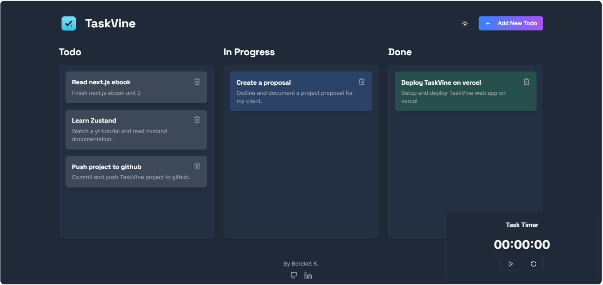

# TaskVine 🌿

A modern, minimalist task management application built with Next.js and Zustand.



## ✨ Features

- **Kanban-style Task Management**: Organize tasks across Todo, In Progress, and Done columns
- **CRUD Operations**: Create, Read, Update, and Delete tasks with ease
- **Drag & Drop Interface**: Seamlessly move tasks between different states
- **Task Timer**: Track time spent on individual tasks
- **Dark/Light Mode**: Built-in theme switching for comfortable viewing
- **Responsive Design**: Works perfectly on both desktop and mobile devices

## 🚀 Tech Stack

- [Next.js 15](https://nextjs.org/) - React Framework
- [Tailwind CSS](https://tailwindcss.com/) - Styling
- [Zustand](https://zustand-demo.pmnd.rs/) - State Management
- [Framer Motion](https://www.framer.com/motion/) - Animations and Transitions
- [dnd-kit](https://dndkit.com/) - Drag and Drop Functionality
- [TypeScript](https://www.typescriptlang.org/) - Type Safety

## 🛠️ Installation

1. Clone the repository:
```bash
git clone https://github.com/bekione/taskvine.git
```

2. Install dependencies:
```bash
cd taskvine
npm install
```

3. Run the development server:
```bash
npm run dev
```

4. Open [http://localhost:3000](http://localhost:3000) in your browser

## 💻 Usage

- Click "Add New Todo" to create a new task
- Drag and drop tasks between columns to update their status
- Use the task timer to track time spent on tasks
- Click the theme toggle to switch between light and dark modes
- Delete tasks using the trash icon

## 📝 Contributing

Contributions are welcome! Please feel free to submit a Pull Request.

1. Fork the project
2. Create your feature branch (`git checkout -b feature/AmazingFeature`)
3. Commit your changes (`git commit -m 'Add some AmazingFeature'`)
4. Push to the branch (`git push origin feature/AmazingFeature`)
5. Open a Pull Request

## 📜 License

This project is licensed under the MIT License - see the [LICENSE](/LICENSE) file for details.

## 👏 Credits

Created by Bereket K.

## 🤝 Support

Give a ⭐️ if you like this project!
